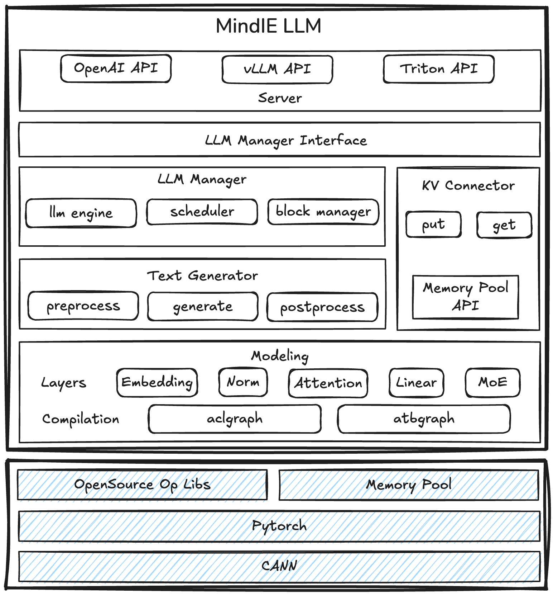

# 架构设计

## 概述

**MindIE LLM**（Mind Inference Engine for Large Language Models）作为 MindIE 系列推理组件中的重要一员，提供基于昇腾（Ascend）亲和的调度、推理优化能力，支持 Continuous Batching、PagedAttention、FlashDecoding 等**推理加速特性**，满足多种高性能推理场景需求。

## 架构介绍



- **Server**：推理引擎服务层，提供模型推理的服务化能力。支持 OpenAI/vLLM/Triton 等主流协协议，由Endpoint进行协议封装转换，提供对外 RESTful 接口。
 
- **LLM Manager**：推理引擎调度层，负责请求状态管理与任务调度。通过CB调度，实现用户请求组成 Batch、推理任务下发、推理结果返回、以及提供状态记录与查询接口。
    - interface：推理引擎接口层，提供模型实例管理、运行相关C++/Python接口，支持与第三方服务化能力进行集成部署。
      
    - engine：负责对 scheduler、executor、worker 等组件进行编排与串联。通过组件间的协同，engine 为不同推理场景提供统一的请求处理与执行能力。
    - scheduler：用于完成请求的入队、等待调度逻辑，通过调度策略，最大化提升host与device计算的协同效率，从而提高系统整体吞吐性能。
    - block manager：负责kv cache内存的高效分配和管理，提供多种分配策略，以提升内存复用效率。
      
    - kv connector: 提供跨卡、跨设备间的的kv cache的链路、传输功能，支持对接多种池化后端。

- **Text Generator**：推理引擎执行层，负责抽象统一的模型前处理、推理、后处理工作流，同时支持SpecDecoding、ChunkPrefill等推理加速特性。

    - preprocess：提供前处理接口，实现原始数据从host到device推理过程中需要的所有数据准备工作。
    - generate：基于引擎的配置参数，实现推理工作流的业务编排，完成模型forward、sample调用。
    - postprocess：提供多种stop逻辑以及token校验方式，以及完成推理过程中的上下文状态的更新与清理。

- **Modeling**：推理引擎后端，专注模型运行时的性能优化。通过CustomLayer形式，提供高效的算子编排、下发、执行接口，支持 ACLGraph 和 ATBGraph 两种图模式后端。

    - Layer：模型通用内置模块，包括 Attention、Embedding、ColumnLinear、RowLinear、MLP、MoE等。
    - Compilation：图引擎后端，将模型从eager mode转换为graph mode，完成整图下发执行，进而提升推理性能。

## 目录结构

```text
├── mindie_llm                                     # 推理引擎Python核心代码
│   ├── text_generator                             # 核心推理引擎
│   │   ├── plugins                                # 高阶特性插件
│   │   │   ├── prefix_cache                       # Prefix Cache
│   │   │   ├── splitfuse                          # SplitFuse 
│   │   │   ├── memory_decoding                    # Memory Decoding
│   │   │   ├── la                                 # Lookahead Decoding
│   ├── modeling                                   # 推理引擎后端
│   │   ├── model_wrapper/atb                      # ATBGraph 后端抽象
│   ├── utils                                      # 工具模块：日志/张量/Profiling/验证等
├── examples                                       # 示例代码
│   ├── atb_models                                 # ATBGraph 模型后端
│   │   ├── atb_framework                          # ATBGraph 运行框架
│   │   ├── atb_llm                                # ATBGraph 适配层
├── docs                                           # 项目文档介绍
├── src                                            # 推理引擎C++核心代码
│   ├── engine                                     # LLM 引擎的主逻辑
│   ├── scheduler                                  # 调度器
│   ├── block_manager                              # KV Cache 块管理
│   ├── llm_manager                                # 引擎调度层
│   ├── server                                     # 服务端
│   ├── utils                                      # 基础工具（共享内存/加密/日志等）
│   ├── include                                    # 对外头文件接口
├── scripts                                        # 构建与部署脚本
├── tools                                          # 工具类
│   ├── llm_manager_python_api_demo                # Python API 使用示例（旧）
├── tests                                          # 测试
├── ...                                            
├── CMakeLists.txt                                 # CMake 构建配置                         
├── README.md   
├── requirements.txt                               # Python 安装依赖                               
```
