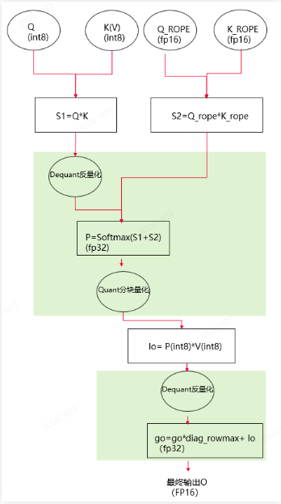

# FA3量化

## 简介

Flash Attention 3（FA3）量化，类似Attention量化，不同之处在于DeepSeek使用MLA算法，k rope的取值变化过大，不适合量化。因此此量化方式将k的非rope张量量化为8bit，k的rope张量不量化。目前使用的量化方案是perhead量化。通过对k的部分量化来减少KV Cache的显存占用，优化decode阶段attention算子的速度，提升吞吐。

> [!NOTE]说明 
>
>- Atlas 800I A2 推理服务器，Atlas 800I A3 超节点服务器支持FA3量化。
>- 支持W8A8配合使用。
>- 仅支持DeepSeek R1，DeepSeek V3，DeepSeek-R1-0528。
>- 仅支持float16。
>- 必须开启KV Cache NZ格式。

FA3量化搭配W8A8量化后权重目录结构：

```text
├─ config.json
├─ quant_model_weight_w8a8.safetensors
├─ quant_model_description.json
├─ tokenizer_config.json
├─ tokenizer.json
└─ tokenizer.model
```

- 量化输出包含：权重文件quant\_model\_weight\_w8a8.safetensors和权重描述文件quant\_model\_description.json。
- 目录中的其余文件为推理时所需的配置文件，不同模型略有差异。

以下展示了量化后权重描述文件quant\_model\_description.json中的部分内容：

```json
{
  "model_quant_type": "W8A8_DYNAMIC",
  "fa_quant_type": "FAKQuant",
  "model.embed_tokens.weight": "FLOAT",
  "model.layers.0.self_attn.q_proj.weight": "W8A8",
  "model.layers.0.self_attn.q_proj.input_scale": "W8A8",
  "model.layers.0.self_attn.q_proj.input_offset": "W8A8",
  "model.layers.0.self_attn.q_proj.quant_bias": "W8A8",
  "model.layers.0.self_attn.q_proj.deq_scale": "W8A8",
  "model.layers.0.self_attn.k_proj.weight": "W8A8",
  "model.layers.0.self_attn.k_proj.input_scale": "W8A8",
  "model.layers.0.self_attn.k_proj.input_offset": "W8A8",
  "model.layers.0.self_attn.k_proj.quant_bias": "W8A8",
  "model.layers.0.self_attn.k_proj.deq_scale": "W8A8",
  "model.layers.0.self_attn.v_proj.weight": "W8A8",
  "model.layers.0.self_attn.v_proj.input_scale": "W8A8",
  "model.layers.0.self_attn.v_proj.input_offset": "W8A8",
  "model.layers.0.self_attn.v_proj.quant_bias": "W8A8",
  "model.layers.0.self_attn.v_proj.deq_scale": "W8A8",
  "model.layers.0.self_attn.o_proj.weight": "W8A8",
  "model.layers.0.self_attn.o_proj.input_scale": "W8A8",
  "model.layers.0.self_attn.o_proj.input_offset": "W8A8",
  "model.layers.0.self_attn.o_proj.quant_bias": "W8A8",
  "model.layers.0.self_attn.o_proj.deq_scale": "W8A8",
}
```

和W8A8量化权重相比：新增fa\_quant\_type描述字段；新增self\_attn字段及下面包含的内容；input\_scale用于将q，k特征量化为int8类型；deq\_scale用于将q，k输出反量化成浮点类型。

**图 1**  FA3量化权重推理时流程  



**表 1**  float16权重量化后dtype及shape信息（假设原始权重的shape为\[n, k\]）

|Tensor信息|dtype|shape|
|--|--|--|
|q_scale|float16|[q_head_num, head_dim]|
|q_offset|float16|[q_head_num, head_dim]|
|k_scale|float16|[kv_head_num, head_dim]|
|k_offset|float16|[kv_head_num, head_dim]|

## 生成权重

1. 请参见[msModelSlim工具](https://gitcode.com/Ascend/msit/blob/master/msmodelslim/docs/%E5%AE%89%E8%A3%85%E6%8C%87%E5%8D%97.md)，安装**msModelSlim**工具。
2. 请参见[msModelSlim的量化说明](https://gitcode.com/Ascend/msit/blob/master/msmodelslim/example/DeepSeek/README.md)，完成**DeepSeek-V3/R1运行前必检内容**。
3. 进入“msmodelslim/example/DeepSeek/”目录，执行如下量化命令。

    ```bash
    python3 quant_deepseek_w8a8.py --model_path {浮点权重路径} --save_path {W8A8量化权重路径} --batch_size 4 --fa_quant --mindie_format
    ```

    FA3量化权重的quant\_model\_description.json中应包含"fa\_quant\_type": "FAKQuant"键值对。

## 执行推理

1. 开启KV Cache NZ格式。

    - 纯模型推理时：在“$\{ATB\_SPEED\_HOME\_PATH\}/atb\_llm/conf/config.json”中将“enable\_nz”设置为“true”。
    - 服务化推理时：在“_\{MindIE安装目录\}_/latest/mindie-service/conf/config.json”的"ModelConfig"字段下添加“enable\_nz”字段，如下所示：

        ```json
        "ModelConfig" : [
                        {
                            "modelInstanceType" : "Standard",
                            "modelName" : "deepseekr1",
                            "modelWeightPath" : "/mnt/nfs/weight/R1_W8A8_FA3_Clamp",
                            "worldSize" : 8,
                            "cpuMemSize" : 5,
                            "npuMemSize" : -1,
                            "backendType" : "atb",
                            "trustRemoteCode" : false,
                            "sp": 1,
                            "tp": 8,
                            "dp": 2,
                            "moe_ep": 4,
                            "moe_tp": 4,
                            "plugin_params": "{\"plugin_type\":\"mtp\",\"num_speculative_tokens\": 1}",
                            "models": {
                                "deepseekv2": {
                                    "kv_cache_options": {
                                    "enable_nz": true
                                    }
                                }
                            }
                        }
        ]
        ```

    > [!NOTE]说明 
    > PD分离推理时，需要在配置文件中将“enable\_nz”设置为“true”。

2. 您可以使用以下指令执行对话测试，推理内容为"What's deep learning?"。

    ```bash
    cd ${ATB_SPEED_HOME_PATH}
    bash examples/models/deepseekv2/run_pa.sh {W8A8量化权重路径}
    ```
