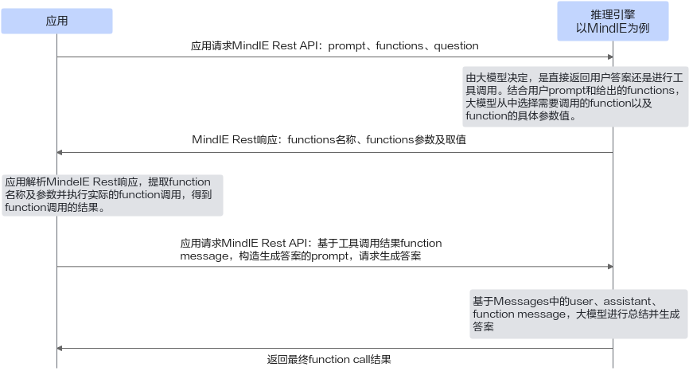

# Function Call

大模型的函数调用（function call）能力，也称工具调用能力（tool use），是指大模型能够调用外部工具以扩展其应用范围的能力。函数调用功能允许模型直接调用外部函数或API，从而获得执行特定任务、获取实时数据或增强决策的能力。这一特性不仅扩展了模型的应用范围，使其能处理更复杂、更具体的问题，还提升了模型的实用性和交互性，实现了大模型与外部世界的高效连接，为用户提供更丰富、更个性化的服务。

以下统一使用“工具调用”（tool use）来介绍function call特性。

**图 1**  大模型工具调用的流程图<a name="fig11208183710820"></a>


## 流程步骤

1. 上层应用将系统prompt和用户输入内容给到大模型，同时由上层应用负责给出大模型本次执行可用的工具集合。
2. 大模型根据系统prompt和用户输入内容，决定是直接返回答案还是从应用给出的工具集合中选取一个或多个函数。如果选择使用工具，则将本次选择的工具名称和工具参数取值信息返回给上层应用。
3. 上层应用解析来自推理引擎的响应，提取模型选择的工具信息，执行模型选择出的函数，得到本次工具调用的结果。
4. 上层应用使用工具调用的结果，构造生成答案的prompt，再次发送给大模型，请求生成最终答案。
5. 大模型根据工具调用的结果，总结信息，生成答案并返回。

## 限制与约束

- Atlas 800I A2 推理服务器、Atlas 800I A3 超节点服务器和Atlas 300I Duo 推理卡支持此特性。
- 当前ChatGLM3-6B、Qwen3-32B、Qwen3-235B-A22B、Qwen3-30B-A3B、DeepSeek-R1-0528、Qwen2.5-Instruct和DeepSeek-V3.1系列模型支持此特性。
- 使用Function Call特性，DeepSeek-V3.1系列模型必须配置[参数说明](#table1)中参数，其余模型可以不配置。
- 当前仅支持OpenAI chat接口。
- Function Call特性支持与量化、长序列、多机推理、PD分离、MoE、Multi-LoRA、SplitFuse、并行解码、专家并行、MTP、Prefix Cache、思考解析（DeepSeek-V3.1模型除外，DeepSeek-V3.1模型能力不支持一条请求同时使能Function Call和思考解析）、张量并行、MLA特性进行叠加，其中SplitFuse、并行解码、MTP特性暂不支持在流式推理下叠加Function call特性。
- Function Call特性当前暂不支持include\_stop\_str\_in\_output、stop、best\_of、n、use\_beam\_search和logprobs后处理参数；当temperature设置较高（导致采样随机性较高），可能会影响触发Function Call的稳定性。
- Function Call特性支持非流式推理，仅Qwen3-32B、Qwen3-235B-A22B、Qwen3-30B-A3B和DeepSeek-R1-0528模型的Function Call特性支持流式推理。
- 当请求报文中包含Function Call功能时，当前版本请求报文最大支持的JSON嵌套层次为10层。

## 参数说明

使用Function Call特性时，可配置的参数如[表1](#table1)所示。

**表 1**  Function Call特性补充参数：**ModelConfig中的models参数** <a id="table1"></a>

|配置项|取值类型|取值范围|配置说明|
|--|--|--|--|
|chat_template|string|.jinja格式的文件路径""|传入自定义的对话模板，替换模型默认的对话模板。<ul><li>默认值：""</li><li>DeepSeek系列模型，tokenizer_config.json中的默认chat_template不支持工具调用，可以使用该参数传入支持工具调用的chat_template。</li><li>DeepSeek系列、Qwen系列（大语言模型），ChatGLM系列，LLaMA系列模型支持使用该参数传入自定义模板。</li></ul>|
|tool_call_options|
|tool_call_parser|string|表2 已注册ToolsCallProcessor中的“可选注册名称”<br>""|使能Function Call时，选择工具的解析方式。<br><ul><li>默认值：""</li><li>当未配置或配置错误值时，将使用当前模型所对应的默认工具解析方式。</li><li>DeepSeek-V3.1模型使用Function Call时，必须配置为"deepseek_v31"，其余模型使用默认值。</li><li>与chat_template配合使用，根据chat_template中指定的Function Call调用格式选择相应的ToolsCallProcessor。|</li></ul>

**表 2**  已注册ToolsCallProcessor   <a id="table2"></a>

|工具解析模块|可选注册名称|说明|
|--|--|--|
|ToolsCallProcessorChatglmV2|chatglm2_6b，chatglm_v2_6b，chatglm_v2，chatglm2|不进行工具解析，直接返回content。|
|ToolsCallProcessorChatglmV3|chatglm3_6b，chatglm_v3_6b，chatglm_v3，chatglm3|适用于ChatGLM3-6B的工具解析模块。|
|ToolsCallProcessorChatglmV4|chatglm4_9b，chatglm_v4_9b，glm_4，glm_4_9b|适用于GLM4-9B的工具解析模块。|
|ToolsCallProcessorDeepseekv3|deepseek_v2，deepseek_v3，deepseekv2，deepseekv3|适用于DeepSeek-R1-0528与DeepSeek-V3-0324的工具解析模块。|
|ToolsCallProcessorDeepseekv31|deepseek_v31，deepseekv31|适用于DeepSeek-V3.1的工具解析模块。|
|ToolsCallProcessorLlama|llama，llama3，llama3_1|适用于LlaMA3的工具解析模块。|
|ToolsCallProcessorQwen1_5_or_2|qwen1_5，qwen_1_5，qwen2，qwen_2，qwen1_5_or_2, qwen_1_5_or_2|适用于Qwen1.5与Qwen2的工具解析模块。|
|ToolsCallProcessorQwen2_5|qwen2_5，qwen_2_5|适用于Qwen2.5的工具解析模块。|
|ToolsCallProcessorQwen3|qwen3，qwen3_moe，hermes|Hermes工具解析方式，适用于Qwen3与Qwen3-moe系列。|

## 执行推理

以使用DeepSeek-V3.1为例，介绍Function Call如何使用。

1. 打开Server的config.json文件。

    ```bash
    cd {MindIE安装目录}/mindie_llm/
    vi conf/config.json
    ```

2. 配置服务化参数。

    按照[参数说明](#参数说明)在Server的config.json文件中添加“tool\_call\_parser”和“chat\_template”字段，服务化参数说明请参见[配置参数说明（服务化）](../user_manual/service_parameter_configuration.md)章节，参数配置示例如下。

    ```json
     "ModelDeployConfig" :
            {
                "maxSeqLen" : 2560,
                "maxInputTokenLen" : 2048,
                "truncation" : 0,
                "ModelConfig" : [
                    {
                        "modelInstanceType" : "Standard",
                        "modelName" : "dsv31",
                        "modelWeightPath" : "/data/weight/DeepSeek-V3.1",
                        "worldSize" : 16,
                        "cpuMemSize" : 0,
                        "npuMemSize" : -1,
                        "backendType" : "atb",
                        "trustRemoteCode" : false,
                        "async_scheduler_wait_time": 120,
                        "kv_trans_timeout": 10,
                        "kv_link_timeout": 1080,
                        "models": {
                                "deepseekv2": {
                                        "tool_call_options": {
                                                "tool_call_parser": "deepseek_v31"
                                        },
                                        "chat_template": "/path/to/tool_chat_template_deepseekv31.jinja"
                                }
                        }
                    }
                ]
            },
    ```

    > [!NOTE]说明
    >- DeepSeek-V3.1模型：“tool\_call\_parser”必须配置为“deepseek\_v31”，否则将默认使用deepseek\_v3的工具解析模块，与DeepSeek-V3.1模型格式不匹配，无法正确解析。
    >- 其余模型：步骤1和2非必要，会自动匹配对应模型的工具解析方式。若配置，需要将“deepseekv2”字段修改为对应模型的“model\_type”。
    >- chat\_template：传入后会覆盖模型tokenizer\_config.json中默认的chat\_template。对于DeepSeek V3.1，DeepSeek R1 0528与DeepSeek V3 0324模型，权重tokenizer\_config.json中默认的chat\_template不支持Function Call，需要传入支持Function Call的chat\_template。
    >- chat\_template的格式（空格与换行符等）可能会影响数据集与Funciton Call评分。

3. 启动服务。

    ```bash
    mindie_llm_server
    ```

4. <a name="step4"></a>向服务发送请求，参数说明见《MindIE Motor开发指南》中的“服务化接口 \> EndPoint业务面RESTful接口 \> 兼容OpenAI接口 \> 推理接口”章节。

    **请求样例：**

    ```json
    curl -H "Accept: application/json" -H "Content-type: application/json" --cacert ca.pem --cert client.pem  --key client.key.pem -X POST -d '{
        "model": "dsv31",
        "messages": [
            {
                "role": "system",
                "content": "You are a helpful customer support assistant. Use the supplied tools to assist the user."
            },
            {
                "role": "user",
                "content": "Hi, can you tell me the delivery date for my order?  my order number is 999888"
            }
        ],
        "tools": [
            {
                "type": "function",
                "function": {
                    "name": "get_delivery_date",
                    "description": "Get the delivery date for a customer\u0027s order. Call this whenever you need to know the delivery date, for example when a customer asks \u0027Where is my package\u0027",
                    "parameters": {
                        "type": "object",
                        "properties": {
                            "order_id": {
                                "type": "string",
                                "description": "The customer\u0027s order ID."
                            }
                        },
                        "required": [
                            "order_id"
                        ],
                        "additionalProperties": false
                    }
                }
            }
        ],
        "tool_choice": "auto",
        "stream": false
    }'  https://127.0.0.1:1025/v1/chat/completions
    ```

    **响应样例：**

    ```json
    {
        "id": "chatcmpl-123",
        "object": "chat.completion",
        "created": 1677652288,
        "model": "dsv31",
        "choices": [
            {
                "index": 0,
                "message": {
                    "role": "assistant",
                    "content": "",
                    "tool_calls": [
                        {
                            "function": {
                                "arguments": "{\"order_id\": \"999888\"}",
                                "name": "get_delivery_date"
                            },
                            "id": "call_JwmTNF3O",
                            "type": "function"
                        }
                    ]
                },
                "finish_reason": "tool_calls"
            }
        ],
        "usage": {
            "prompt_tokens": 226,
            "completion_tokens": 122,
            "total_tokens": 348
        },
        "prefill_time": 200,
        "decode_time_arr": [56, 28, 28, 28, 28, ..., 28, 32, 28, 28, 41, 28, 25, 28]
    }
    ```

    根据模型返回的tool\_calls调用相关的本地工具，使用assistant角色关联[4](#step4)中接口返回的tool\_calls和id，并使用tool角色关联工具执行的结果和[4](#step4)中接口返回的id，向大模型发送请求。

    ```json
    curl -H "Accept: application/json" -H "Content-type: application/json" --cacert ca.pem --cert client.pem  --key client.key.pem -X POST -d '{
        "model": "dsv31",
        "messages": [
            {
                "role": "user",
                "content": "Hi, can you tell me the delivery date for my order?  my order number is 999888"
            },
            {
                "role": "assistant",
                "content": "",
                "tool_calls": [
                    {
                        "function": {
                            "arguments": "{\"order_id\": \"999888\"}",
                            "name": "get_delivery_date"
                        },
                        "id": "call_JwmTNF3O",
                        "type": "function"
                    }
                ]
            },
            {
                "role": "tool",
                "content": "the delivery date is 2024.09.10.",
                "tool_call_id": "call_JwmTNF3O"
            }
        ],
        "stream": false,
        "max_tokens": 4096
    }' https://127.0.0.1:1025/v1/chat/completions
    ```
