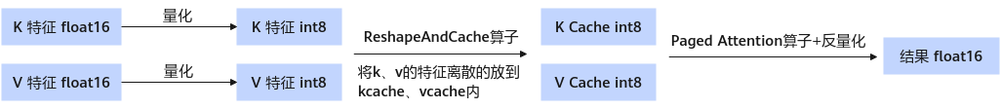

# KV Cache int8

## 简介

此量化方式将k cache和v cache量化为8 bit，通过减少KV Cache的显存占用，在显存受限场景（如长序列场景）下，可以减少重计算触发次数以提升吞吐。

> [!NOTE]说明 
>
>- 仅Atlas 800I A2 推理服务器支持KV Cache int8量化。
>- 仅支持搭配W8A8使用。
>- 仅支持LLaMA3.1-70B，Qwen2-72B，Qwen2.5-72B-Instruct。
>- 仅支持float16数据类型。

KV Cache int8搭配W8A8量化后权重目录结构：

```text
├─ config.json
├─ quant_model_weight_w8a8.safetensors
├─ quant_model_description_w8a8.json
├─ tokenizer_config.json
├─ tokenizer.json
└─ tokenizer.model
```

- 量化输出包含：权重文件quant\_model\_weight\_w8a8.safetensors和权重描述文件quant\_model\_description.json。
- 目录中的其余文件为推理时所需的配置文件，不同模型略有差异。

以下展示了量化后权重描述文件quant\_model\_description.json中的部分内容：

```json
{
  "model_quant_type": "W8A8",
  "kv_cache_type": "C8",
  "model.embed_tokens.weight": "FLOAT",
  "model.layers.0.self_attn.q_proj.weight": "FLOAT",
  "model.layers.0.self_attn.k_proj.weight": "FLOAT",
  "model.layers.0.self_attn.k_proj.kv_cache_scale": "W8A8",
  "model.layers.0.self_attn.k_proj.kv_cache_offset": "W8A8",
  "model.layers.0.self_attn.v_proj.weight": "FLOAT",
  "model.layers.0.self_attn.v_proj.kv_cache_scale": "W8A8",
  "model.layers.0.self_attn.v_proj.kv_cache_offset": "W8A8"
}
```

和W8A8量化权重相比，新增kv\_cache\_type描述字段，新增kv linear激活值量化缩放因子权重文件kv\_cache\_scale和kv linear激活值量化偏移值权重文件kv\_cache\_offset。推理时会基于这两个权重，推导出k\_quant\_scale，k\_dequant\_scale，v\_quant\_scale，v\_dequant\_scale，k\_quant\_offset，k\_dequant\_offset，v\_quant\_offset和v\_dequant\_offset。其中quant\_scale和quant\_offset用于将k和v特征量化为int8类型，dequant\_scale和dequant\_offset用于将Paged attention的输出反量化为浮点类型。

**图 1**  量化权重推理时流程<a name="fig792521919554"></a>  


**表 1**  float16权重量化后dtype及shape信息（假设原始权重的shape为\[n, k\]）

|Tensor信息|kv_cache_scale|kv_cache_offset|
|--|--|--|
|dtype|float16|float16|
|shape|[kv_head_num * kv_head_dim]|[kv_head_num * kv_head_dim]|

**表 2**  bfloat16权重量化后dtype及shape信息（假设原始权重的shape为\[n, k\]）

|Tensor信息|kv_cache_scale|kv_cache_offset|
|--|--|--|
|dtype|bfloat16|bfloat16|
|shape|[kv_head_num * kv_head_dim]|[kv_head_num * kv_head_dim]|
