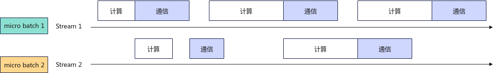

# Micro Batch

Micro Batch即在批处理过程中，将数据切分为更小粒度的多个batch运行。当前实现中，通过额外创建一条数据流，将一批数据分成两个batch在两条数据流上执行。数据流1在执行计算时，数据流2可进行通信，计算和通信耗时掩盖，使得硬件资源得以充分利用，以提高推理吞吐。

**图 1**  Micro Batch双流示意图<a name="fig13635185816491"></a>  


数据流间通过Event机制进行同步，计算和通信任务间都相互不冲突，防止硬件资源抢占。此特性通常应用在Prefill阶段，因为Prefill阶段通信类算子耗时较长，且通信类算子与计算类算子耗时占比更为均衡。在此实现下，计算和通信类算子掩盖率达70%+。

## 限制与约束

-  此特性不能与通信计算融合算子特性同时开启。
-  此特性不能与Python组图同时开启。
-  此特性仅支持和量化特性同时开启。
-  仅Qwen2.5-14B、Qwen3-14B、Deepseek-R1和DeepSeek-V3.1模型支持此特性。
-  开启此特性后会带来额外的显存占用。服务化场景下，KV Cache数量下降会影响调度导致吞吐降低，在显存受限的场景下，不建议开启。

## 参数说明

开启Micro Batch特性，需要配置的参数如[表1](#table1)所示。

**表 1**  Micro Batch特性补充参数：**ModelConfig中的models参数**  <a id="table1"></a>

|配置项|取值类型|取值范围|配置说明|
|--|--|--|--|
|stream_options|
|micro_batch|bool|<ul><li>true</li><li>false</li></ul>|开启通信计算双流掩盖特性。<br>默认值：false（关闭）|


## 执行推理

1. 打开Server的config.json文件。

    ```bash
    cd {MindIE安装目录}/latest/mindie-service/
    vi conf/config.json
    ```

2. 配置服务化参数。在Server的config.json文件添加“micro\_batch”字段（以下加粗部分），参数字段说明请参见[表1](#table1)，服务化参数说明请参见[配置参数说明（服务化）](../user_manual/service_parameter_configuration.md)章节，参数配置示例如下。

    ```json
    "ModelDeployConfig" :
    {
       "maxSeqLen" : 2560,
       "maxInputTokenLen" : 2048,
       "truncation" : false,
       "ModelConfig" : [
         {
             "modelInstanceType" : "Standard",
             "modelName" : "Qwen3-14B",
             "modelWeightPath" : "/data/weights/Qwen3-14B",
             "worldSize" : 8,
             "cpuMemSize" : 5,
             "npuMemSize" : -1,
             "backendType" : "atb",
             "trustRemoteCode" : false,
             "models": {
                "qwen3": {
                    "ccl": {
                        "enable_mc2": false,
                    },
                    "stream_options": {
                        "micro_batch": true,
                    }
                }
             }
          }
       ]
    },
    ```

3. 启动服务。

    ```
    ./bin/mindieservice_daemon
    ```

