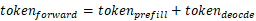
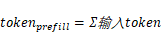
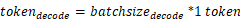

# SplitFuse

SplitFuse特性的目的是将长prompt request分解成更小的块，并在多个forward step中进行调度，只有最后一块的forward完成后才开始这个prompt request的生成。将短prompt request组合以精确填充step的空隙，每个step的计算量基本相等，达到所有请求平均延迟更稳定的目的。

当MindIE在默认情况下使用PD混部策略，Prefill和Decode阶段请求不会同时被组合成一个batch。打开SplitFuse特性后，MindIE会在优先处理Decode请求的基础上，且batch小于maxBatchSize的情况下在同一批次中加入Prefill请求。

当该次处理的feedforward大于splitchunk tokens时，SplitFuse会对其进行切分，解释如下所示：

- 每一推理轮次中：，其中：  
- Prefill阶段的tokens为输入token数量，Decode阶段每个请求为1token：

两个关键行为：

1. 长prompts被分解成更小的块，并在多个迭代中进行调度，只有最后一遍迭代执行输出生成token。

2. 短prompts也可能切分成小块，以确保计算效率发挥最佳。

其优势主要包括：

- **提高响应速度**：减少长prompt处理延迟，提升用户体验。

- **提升效率**：通过合理组合短prompt，保持模型高吞吐量运行。

- **增强一致性**：统一前向传递大小，降低延迟波动，使生成频率更稳定。

## 限制与约束

- Atlas 800I A2 推理服务器和 Atlas 800I A3 超节点服务器支持此特性。
- LLaMA3.1-70B浮点模型，Qwen2，Qwen2.5，Qwen3系列模型支持此特性。
- 该特性支持的量化特性：W8A8，其他量化特性暂不支持。
- 该特性不能和Multi-LoRA、Function Call、并行解码、MTP、长序列特性同时使用。
- 该特性支持n、best\_of、use\_beam\_search后处理参数。

## 参数说明

开启SplitFuse特性，需要配置的补充参数如[表1](#table1)和[表2](#table2)所示。

**表 1**  SplitFuse特性补充参数1：**ModelDeployConfig中的ModelConfig参数** <a id="table1"></a>

|配置项|取值类型|取值范围|配置说明|
|--|--|--|--|
|plugin_params|std::string|"{\"plugin_type\":\"splitfuse\"}"|<ul><li>设置为"{\"plugin_type\":\"splitfuse\"}"，表示执行splitfuse。</li><li>不需要生效任何插件功能时，请删除该配置项字段。</li></ul><br>**约束**：**若templateType为"Mix"，则此处必须开启为splitfuse（特性不开启时非必填项）**。|

**表 2**  SplitFuse特性补充参数2：**ScheduleConfig的参数**  <a id="table2"></a>

|配置项|取值类型|取值范围|配置说明|
|--|--|--|--|
|templateType|std::string|"Standard"或"Mix"|<ul><li>"Mix"：混部推理场景；Prefill和Decode可同时进行批处理。</li><li>"Standard"：默认值（特性不开启时为必填项），表示prefill和decode各自分别组batch。</li></ul>|
|prefillChunkSize|uint32_t|[1,maxPrefillTokens]|设置此值时表示开启对prefill请求的固定长度切分，不配置此值时将根据maxPrefillTokens和prefill请求数量计算当前切分长度，进行动态切分。|
|maxNumPartialPrefills|uint32_t|[1,maxBatchSize]|动态切分时使用，表示batch中可以被并行做partial prefill的最大请求数。默认值：64。|
|longPrefillTokenThreshold|uint32_t|[1,maxPrefillTokens]|动态切分时使用，表示被判定为长prefill请求的token数阈值，请求的prompt长度大于此阈值且batch中长prefill请求个数超过maxLongPartialPrefills时，超出部分将被延时调度以保障短序列的TTFT时延。默认值：1024。|
|maxLongPartialPrefills|uint32_t|[1,maxBatchSize]|动态切分时使用，表示batch中允许容纳的长prefill请求个数。默认值：8。|

## 执行推理

1. 打开Server的config.json文件。

    ```bash
    cd {MindIE安装目录}/latest/mindie-service/
    vi conf/config.json
    ```

2. 配置服务化参数。在Server的config.json文件添加“plugin\_params“、“templateType“参数。对于性能调优，需要编辑config.json配置文件中的**ScheduleConfig**部分，建议在需要固定大小的切块长度时配置prefillChunkSize参数，其余场景可使用默认的动态切分配置。

    SplitFuse参数请参见[表1](#table1)和[表2](#table2)，服务化参数说明请参见[配置参数说明（服务化）](../user_manual/service_parameter_configuration.md)章节，参数配置示例如下。

    ```json
            "ModelDeployConfig":
            {
                "maxSeqLen" : 65536,
                "maxInputTokenLen" : 65536,
                "truncation" : 0,
                "ModelConfig" : [
                    {
                        "modelInstanceType": "Standard",
                        "modelName" : "llama3-70b",
                        "modelWeightPath" : "/home/models/llama3-70b/",
                        "worldSize" : 8,
                        "cpuMemSize" : 5,
                        "npuMemSize" : -1,
                        "backendType": "atb",
                        "plugin_params": "{\"plugin_type\":\"splitfuse\"}"
                    }
                ]
            },
            "ScheduleConfig":
            {
                "templateType": "Mix",
                "templateName" : "Standard_LLM",
                "cacheBlockSize" : 128,
    
                "maxPrefillBatchSize" : 40,
                "maxPrefillTokens" : 65536,
                "prefillTimeMsPerReq" : 600,
                "prefillPolicyType" : 0,
    
                "decodeTimeMsPerReq" : 50,
                "decodePolicyType" : 0,         
                "maxBatchSize" : 256,
                "maxIterTimes" : 512,
                "maxPreemptCount" : 0,
                "supportSelectBatch" : false,
                "maxQueueDelayMicroseconds" : 5000,
              
                "prefillChunkSize" : 1024,
                "maxNumPartialPrefills" : 64,
                "longPrefillTokenThreshold" : 1024,
                "maxLongPartialPrefills" : 8,
            }
    ```

3. 启动服务。

    ```bash
    ./bin/mindieservice_daemon
    ```

4. 本样例以MindIE Benchmark方式展示调优方式。config.json配置完成后，执行如下MindIE Benchmark启动命令。也可以使用AISBench工具进行性能测试，详情请参见《MindIE Motor开发指南》中的“性能测试”章节。

    ```bash
    benchmark \
    --DatasetPath "/{数据集路径}/GSM8K" \
    --DatasetType "gsm8k" \
    --ModelName llama3-70b \
    --ModelPath "/{模型权重路径}/llama3-70b" \
    --TestType client \
    --Http https://{ipAddress}:{port} \
    --ManagementHttp https://{managementIpAddress}:{managementPort} \
    --Concurrency 100 \
    --RequestRate 5 \
    --TaskKind stream \
    --Tokenizer True \
    --MaxOutputLen 512 \
    --TestAccuracy True
    ```
    
5. 根据首Token时延和Decode时延的实际数据调整参数。
    - 首Token时延和Decode时延（均值，P90）都满足约束阈值，则加大“RequestRate“的值。
    - Decode时延均值位于约束阈值以内，而首Token时延均值大于约束阈值。则“RequestRate“已大于系统吞吐，为满足约束需降低“RequestRate“的值。
    - 当首Token时延均值和Decode时延均值满足阈值约束，而Decodes时延P90不满足均值时，则考虑降低ChunkSize减小切分，但该操作可能影响吞吐。
    - 在输入问题长短不一的场景下，PD混部策略产生更多调度空泡；而SplitFuse特性相对PD混部策略受调度空泡影响较少，所以相对PD混部策略的优势会增加。
