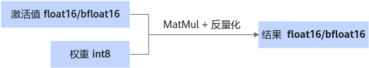

# W8A16

## 简介

此量化方式对激活值不做量化，仅将权重量化为8 bit。使用per Channel量化。

> [!NOTE]说明
>
>- 仅Atlas 800I A2 推理服务器支持此量化方式。
>- 仅支持LLaMA3-70B，Qwen1.5-110B，Qwen2-72B。
>- 仅支持和Anti-Outlier离群值处理、KV Cache int8量化配合使用。

量化后权重目录结构：

```text
├─ config.json
├─ quant_model_weight_w8a16.safetensors
├─ quant_model_description.json
├─ tokenizer_config.json
├─ tokenizer.json
└─ tokenizer.model
```

- 量化输出包含：权重文件quant\_model\_weight\_w8a16.safetensors和权重描述文件quant\_model\_description.json。
- 目录中的其余文件为推理时所需的配置文件，不同模型略有差异。

以下展示了量化后权重描述文件quant\_model\_description.json中的部分内容：

```json
{
  "model_quant_type": "W8A16",
  "model.embed_tokens.weight": "FLOAT",
  "model.layers.0.self_attn.q_proj.weight": "W8A16",
  "model.layers.0.self_attn.q_proj.weight_scale": "W8A16",
  "model.layers.0.self_attn.q_proj.weight_offset": "W8A16"
}
```

量化后的MatMul权重新增weight\_scale和weight\_offset，用于对MatMul的计算结果进行反量化。

**图 1**  量化权重推理时流程<a name="fig132131518185315"></a>


此量化方式支持量化float16或bfloat16类型的原始权重。

**表 1**  float16权重量化后dtype及shape信息（假设原始权重的shape为\[n, k\]）

|Tensor信息|weight|weight_scale|weight_offset|bias|
|--|--|--|--|--|
|dtype|int8|float32|float32|float16|
|shape|[n, k]|[n, 1]|[n, 1]|[n]|

**表 2**  bfloat16权重量化后dtype及shape信息（假设原始权重的shape为\[n, k\]）

|Tensor信息|weight|weight_scale|weight_offset|bias|
|--|--|--|--|--|
|dtype|int8|float32|float32|float32|
|shape|[n, k]|[n, 1]|[n, 1]|[n]|

> [!NOTE]说明
> 仅当浮点权重存在bias场景时，量化权重才会有bias。
