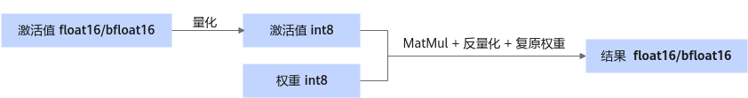

# W8A8SC稀疏量化

## 简介

大模型稀疏量化工具包括稀疏、量化和压缩三个部分：

- 稀疏：模型稀疏工具通过算法判断模型权重中每个元素对精度结果的重要性，并将模型权重中对最终精度影响小的权重值置零。
- 量化：对权重和激活值都做量化，将高位浮点数转为8bit，可以直接降低权重体积，带来性能收益。
- 压缩：权重压缩工具将模型权重通过压缩算法进一步编码压缩，最大程度地降低权重体积，生成压缩后权重和索引文件。

> [!NOTE]说明
>
>- 压缩算法和硬件强相关，仅Atlas 300I Duo 推理卡支持稀疏量化。
>- bfloat16权重不支持稀疏量化。
>- 仅支持Qwen3-8B、Qwen3-14B和Qwen3-32B。
>- 仅支持和并行解码、Prefix Cache、Function Call、长序列特性同时使用。

稀疏+量化后权重目录结构：

```text
├─ config.json
├─ quant_model_weight_w8a8s.safetensors
├─ quant_model_description.json
├─ tokenizer_config.json
├─ tokenizer.json
└─ tokenizer.model
```

- 量化后产物包含：权重文件quant\_model\_weight\_w8a8s.safetensors和权重描述文件quant\_model\_description.json。
- 目录中的其余文件为推理时所需的配置文件，不同模型略有差异。

以下展示了量化后权重描述文件quant\_model\_description.json中的部分内容：

```json
{
  "model_quant_type": "W8A8S",
  "model.embed_tokens.weight": "FLOAT",
  "model.layers.0.self_attn.q_proj.weight": "W8A8S",
  "model.layers.0.self_attn.q_proj.input_scale": "W8A8S",
  "model.layers.0.self_attn.q_proj.input_offset": "W8A8S",
  "model.layers.0.self_attn.q_proj.quant_bias": "W8A8S",
  "model.layers.0.self_attn.q_proj.deq_scale": "W8A8S",
}
```

量化后的MatMul权重新增input\_scale、input\_offset、quant\_bias和deq\_scale。其中input\_scale和input\_offset用于对激活值进行量化。MatMul使用量化后的激活值和量化权重进行计算。quant\_bias和deq\_scale用于对MatMul的计算结果进行反量化。

压缩后权重目录结构：

```text
├─ config.json
├─ part0-of-4
│  ├─ quant_model_weight_w8a8sc.safetensors
│  └─ quant_model_description.json
├─ part1-of-4
│  ├─ quant_model_weight_w8a8sc.safetensors
│  └─ quant_model_description.json
├─ part2-of-4
│  ├─ quant_model_weight_w8a8sc.safetensors
│  └─ quant_model_description.json
├─ part3-of-4
│  ├─ quant_model_weight_w8a8sc.safetensors
│  └─ quant_model_description.json
├─ tokenizer_config.json
├─ tokenizer.json
└─ tokenizer.model
```

压缩前会先加载权重，并进行多卡切分，压缩算法须在切分后的权重上执行。

以下展示了量化后权重描述文件part0-of-4/quant\_model\_description.json中的部分内容：

```json
{
  "model_quant_type": "W8A8SC",
  "transformer.wte.weight": "FLOAT",
  "transformer.h.0.attn.c_attn.weight": "W8A8SC",
  "transformer.h.0.attn.c_attn.index": "W8A8SC",
  "transformer.h.0.attn.c_attn.info": "W8A8SC",
  "transformer.h.0.attn.c_attn.input_scale": "W8A8S",
  "transformer.h.0.attn.c_attn.input_offset": "W8A8S",
  "transformer.h.0.attn.c_attn.deq_scale": "W8A8S",
  "transformer.h.0.attn.c_attn.quant_bias": "W8A8S",
}
```

压缩后的MatMul权重相比量化新增了index，压缩信息用于复原权重。

**图 1**  量化权重推理时流程<a name="fig13717203714549"></a>  


**表 1**  float16权重量化后dtype及shape信息（假设原始权重的shape为\[n, k\]）

|Tensor信息|weight|input_scale|input_offset|quant_bias|deq_scale|index|
|--|--|--|--|--|--|--|
|dtype|int8|float16|int8|int32|int64|int8|
|shape|[x]x的取值范围为(0, n * k)。|[1]|[1]|[n]|[n]|[y]y由以下计算得出。y = k_index *n_index* 8k_index = ceil(k1 / tilingK)n_index = ceil(n1 / tilingN)k1 = k / 32n1 = n / 16其中，ceil()为向上取整函数 ，tilingK和tilingN为稀疏量化默认参数。|

## 前提条件

在使用稀疏量化脚本之前，需要安装压缩工具msmodelslim，安装步骤参见《msModelSlim工具》的“[msModelSlim安装](https://gitcode.com/Ascend/msit/blob/master/msmodelslim/docs/%E5%AE%89%E8%A3%85%E6%8C%87%E5%8D%97.md)”章节。

## 生成权重

以Qwen3-8B为例：

1. 使用以下指令生成W8A8S量化权重。

    ```bash
    msmodelslim quant --model_path ${浮点权重路径} --save_path ${W8A8S量化权重保存路径} --device npu --model_type Qwen3-8B --quant_type w8a8s --trust_remote_code True
    ```

    - 以上指令包含生成Qwen3-8B W8A8S稀疏量化权重的最优参数配置，不同模型的参数配置不同，请参考模型Readme文件。
    - 生成权重后需将浮点权重下的special\_tokens\_map.json文件复制到W8A8S量化权重路径

2. 使用以下指令设置msModelSlim工具所在的Python路径环境变量，\{Python Lib Path\}为安装msmodelslim时编译步骤中所在的Python路径。

    ```bash
    export LD_LIBRARY_PATH={Python Lib Path}/lib:$LD_LIBRARY_PATH
    ```

3. 使用以下指令对量化权重进行压缩，生成W8A8SC量化权重。

    ```bash
    torchrun --nproc_per_node {TP数} -m examples.convert.model_slim.sparse_compressor --model_path {W8A8S量化权重路径} --save_directory {W8A8SC量化权重路径}
    ```

    TP数为张量并行个数，需和权重运行时的张量并行个数保持一致。

## 执行推理

以Qwen3-8B为例，您可以使用以下指令执行对话测试，推理内容为"What's deep learning?"。

```bash
cd ${ATB_SPEED_HOME_PATH}
bash examples/models/qwen/run_pa.sh -m {W8A8SC量化权重路径} --trust_remote_code true
```
