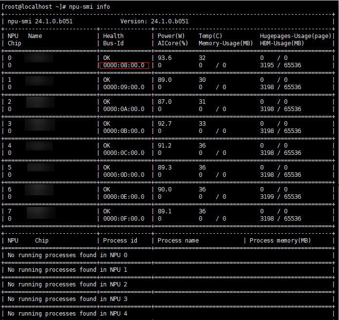
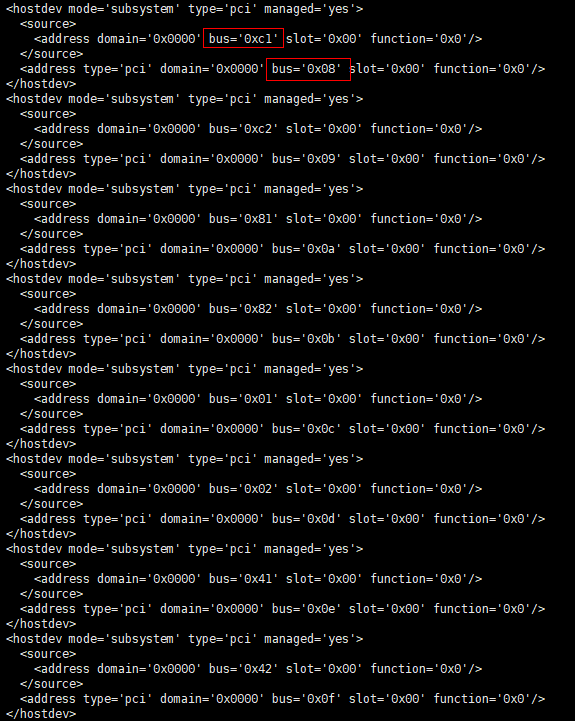
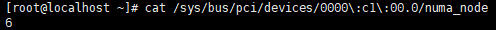
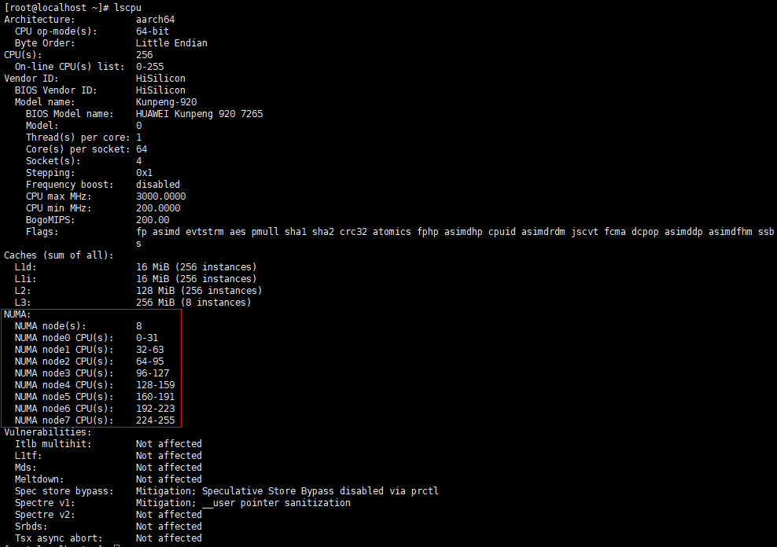
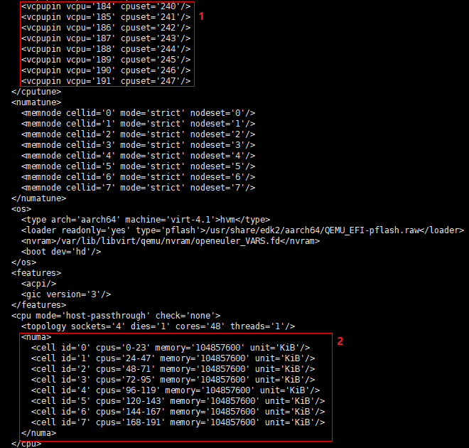
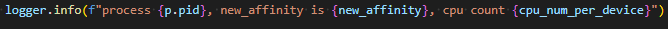

# 虚拟机手动绑核配置介绍

在虚拟机场景下使用ATB Models进行推理时，为提高性能，需要用户进行手动绑核操作：

1. 在虚拟机中，使用`npu-smi info`命令查询npu对应的pci id，如[图1](#figure1)所示。

    **图 1**  npu 0对应的pci id为0000:08:00.0    
    
    

2. 查询物理机和虚拟机的pci id对应关系。在物理机上使用virsh edit \{虚拟机名称\}查询，虚拟机名称可通过`virsh list --all`查询到。

    查询页面如[图2](#figuer2)所示，其中可以找到物理机和虚拟机的pci之间的关系。

    **图 2**  虚拟机上的pci id 0000:08:00.0对应了物理机的0000:C1:00.0   
    

3. 在物理机上使用命令`cat /sys/bus/pci/devices/\{pci id\}/numa\_node`查询NUMA（Non Uniform Memory Access Architecture） node，如[图3](#figure3)所示。

    **图 3**  0000:C1:00.0对应的NUMA node为6   
    

4. 在物理机上使用命令`lscpu`查询NUMA node对应的cpu，如[图4](#figure4)所示。

    **图 4**  NUMA node 6对应的cpu为192-223   
    

5. 查询物理机和虚拟机的NUMA node对应关系，在物理机上使用命令`virsh edit \{_虚拟机名称_\}`查询，虚拟机名称可通过命令`virsh list --all`查询。查询页面如[图5](#figure5)所示：

    红框1表示了虚拟机cpu和物理机cpu的对应关系，如：虚拟机cpu 191对应了物理机247。

    红框2的<numa\>中cell id='0' cpus='0-23'表示numa\_node = 0时，虚拟机cpu号为0-23。

    物理机NUMA node 6的cpu为192-223，经查询，其对应虚拟机cpu为144-167，即物理机NUMA node 6对应虚拟机NUMA node 6，因此npu 0对应的虚拟机NUMA node为6。

    **图 5**  虚拟机配置界面   
    

6. 在虚拟机中执行`echo  _x_  \> /sys/bus/pci/devices/\{_pci id_\}/numa\_node`，其中x为[5](#step5)中查询到的npu对应的虚拟机NUMA node，_pci id_为虚拟机上的pci id。

    以npu 0为例，命令为`echo 6 \> /sys/bus/pci/devices/0000\\:08\\:00.0/numa\_node`。

    至此虚拟机npu 0完成绑核操作。

7. 通过查询MindIE LLM日志，验证绑核成功的npu。查询日志的方式请参见《MindIE日志参考》的“查看日志”章节。

    当日志如图6所示，即可显示绑定成功的npu。

    **图 6**  绑定成功的npu  
    
