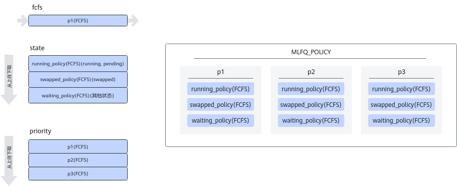

# 配置参数说明（服务化）

> [!NOTE]说明
>
>
>- Server的配置文件config.json，获取路径为：_\{MindIE安装目录\}_/mindie_llm/conf/config.json
>- 系统读取配置文件时，会先校验文件大小，若文件大小范围不在\(0MB, 10MB\]，将读取失败。

## 配置文件参数说明

|配置项|取值类型|取值范围|配置说明|
|--|--|--|--|
|Version|std::string|"1.0.0"|标注配置文件版本，当前版本指定为1.0.0，不支持修改。|
|ServerConfig|map|-|服务端相关配置，例如ip:port、网络请求、网络安全等。详情请参见[ServerConfig参数说明](#serverconfig参数说明)。|
|BackendConfig|map|-|模型后端相关配置，包含调度、模型相关配置。详情请参见[BackendConfig参数说明](#backendconfig参数说明)。|
|LogConfig|map|-|日志级别相关配置。详情请参见[LogConfig参数说明](#logconfig参数说明)。|
|EnableDynamicAdjustTimeoutConfig|bool|<li>true</li><li>false</li>|超时时间动态配置参数。 若设置为true，则动态将推理相关的超时时延全部设置为最大值。|

## ServerConfig参数说明

|配置项|取值类型|取值范围|配置说明|
|--|--|--|--|
|ipAddress|std::string|IPv4或IPv6地址。|必填，默认值："127.0.0.1"。 EndPoint提供的业务面RESTful接口绑定的IP地址。<ul><li>如果存在环境变量MIES_CONTAINER_IP，则优先取环境变量值作为业务面IP地址。</li><li>如果不存在环境变量MIES_CONTAINER_IP，则取该配置值。</li></ul>**说明** 全零监管会导致三面隔离失效，不满足安全配置要求，故默认禁止绑定IP地址为0.0.0.0。若仍需绑定IP地址为0.0.0.0，那么在保证安全前提下，需要将配置文件中的**allowAllZeroIpListening**设置为**true**。|
|managementIpAddress|std::string|IPv4或IPv6地址。|选填，默认值："127.0.0.2"。 EndPoint提供的内部RESTful接口绑定的IP地址。<ul><li>如果该环境变量MIES_CONTAINER_MANAGEMENT_IP存在，则直取环境变量值作为内部接口IP地址。</li><li>如果**managementIpAddress**字段存在，则取字段本身值；否则取**ipAddress**字段的值作为内部接口IP地址。</li><li>如果采用多IP地址的方案，对**ipAddress**和**managementIpAddress**的初始值都需要做相应的修改。</li></ul>**说明** 全零监管会导致三面隔离失效，不满足安全配置要求，故默认禁止绑定IP地址为0.0.0.0。若仍需绑定IP地址为0.0.0.0，那么在保证安全前提下，需要将配置文件中的**allowAllZeroIpListening**设置为**true**。|
|port|int32_t|[1024, 65535]|必填，默认值：1025。 EndPoint提供的业务面RESTful接口绑定的端口号。 如果采用物理机/宿主机IP地址通信，请自行保证端口号无冲突。|
|managementPort|int32_t|[1024, 65535]|选填，默认值：1026。 EndPoint提供的内部接口绑定的端口号。（内部接口请参见表1） 业务面与内部接口可采用四种方案：<ul><li>多IP地址多端口号（推荐）</li><li>多IP地址单端口号</li><li>单IP地址多端口号</li><li>单IP地址单端口号</li></ul>|
|metricsPort|int32_t|[1024, 65535]|选填，默认值：1027。 服务管控指标接口（普罗格式）端口号。可以与**managementPort**值相同或不同。|
|allowAllZeroIpListening|bool|<ul><li>true</li><li>false</li></ul>|必填，默认值：false，建议值：false。取值为true时，会存在全零监管风险，用户环境需要自行保证具备全零监管的防护能力。 是否支持全零监管IP配置。<ul><li>true：支持全零监管IP配置。</li><li>false：不支持全零监管IP配置。</li></ul>|
|maxLinkNum|uint32_t|[1, 4096]|必填，默认值：1000。 RESTful接口请求并发处理数，EndPoint支持的最大并发请求处理数。 表示有maxLinkNum个请求正在并发处理，此外有2\*maxLinkNum个请求在队列中等待。因此第3\*maxLinkNum+1个请求会被拒绝。 推荐设置为300。1000并发能力受模型性能影响受限支持，一般较小模型、较低序列长度下才可以使用1000并发。|
|httpsEnabled|bool|<ul><li>true</li><li>false</li></ul>|必填，默认值：true，建议值：true，建议开启，不开启会存在较高的网络安全风险。 是否开启HTTPS通信安全认证。<ul><li>true：开启HTTPS通信。</li><li>false：关闭HTTPS通信。</li></ul>取值为false时，忽略后续HTTPS通信相关参数。|
|fullTextEnabled|bool|<ul><li>true</li><li>false</li></ul>|选填，默认值：false。 是否开启流式接口全量返回历史结果。<ul><li>true：开启流式接口全量返回历史结果。</li><li>false：关闭流式接口全量返回历史结果。</li></ul>|
|tlsCaPath|std::string|文件绝对路径长度范围为[1,4096]。实际路径为工程路径+tlsCaPath。|根证书路径，只支持软件包安装路径下的相对路径。 **httpsEnabled**=**true**生效，生效后必填，默认值："security/ca/"。|
|tlsCaFile|std::set`<std::string>`|文件绝对路径长度范围为[1,4096]。列表元素个数最小为1，最大为3。|业务面根证书名称列表。 **httpsEnabled**=**true**生效，生效后必填，默认值：["ca.pem"]。|
|tlsCert|std::string|文件绝对路径长度范围为[1,4096]。实际路径为工程路径+tlsCert。|业务面服务证书文件路径，只支持软件包安装路径下的相对路径。 **httpsEnabled**=**true**生效，生效后必填，默认值："security/certs/server.pem"。|
|tlsPk|std::string|文件绝对路径长度范围为[1,4096]。实际路径为工程路径+tlsPk。|业务面服务证书私钥文件路径，只支持软件包安装路径下的相对路径，证书私钥的长度要求>=3072。 **httpsEnabled**=**true**生效，生效后必填，默认值："security/keys/server.key.pem"。|
|tlsPkPwd|std::string|文件绝对路径长度范围为[0,4096]。实际路径为工程路径+tlsPkPwd。|业务面服务证书私钥加密密钥文件路径，只支持软件包安装路径下的相对路径。 **httpsEnabled**=**true**生效，生效后选填，默认值："security/pass/key_pwd.txt"。 若私钥经过加密但是未提供此文件，系统启动时会要求用户在交互窗口输入私钥加密口令。|
|tlsCrlPath|std::string|tlsCrlPath+tlsCrlFiles路径长度范围为[0,4096]。实际路径为工程路径+tlsCrlPath。|业务面服务证书吊销列表文件夹路径，只支持软件包安装路径下的相对路径。<ul><li>**httpsEnabled**=**true**生效，生效后选填，默认值："security/certs/"。</li><li>**httpsEnabled**=**false**不启用吊销列表。</li></ul>|
|tlsCrlFiles|std::set`<std::string>`|tlsCrlPath+tlsCrlFiles路径长度范围为[1,4096]。列表元素个数最小为1，最大为3。|业务面吊销列表名称列表。 **httpsEnabled**=**true**生效，生效后选填，默认值：["server_crl.pem"]。|
|managementTlsCaFile|std::set`<std::string>`|建议tlsCaPath+managementTlsCaFile路径长度范围为[0,4096]。列表元素个数最小为1，最大为3。|内部接口根证书名称列表，当前内部接口证书和业务面证书放在同一个路径（tlsCaPath）下。 **httpsEnabled**=**true**且**ipAddress**!=**managementIpAddress**生效，生效后必填，默认值：["management_ca.pem"]。|
|managementTlsCert|std::string|文件路径长度范围为[1,4096]。实际路径为工程路径+managementTlsCert。|内部接口服务证书文件路径，只支持软件包安装路径下的相对路径。 **httpsEnabled**=**true**且**ipAddress**!=**managementIpAddress**生效，生效后必填，默认值："security/certs/management/server.pem"。|
|managementTlsPk|std::string|文件路径长度范围为[1,4096]。实际路径为工程路径+managementTlsPk。|内部接口服务证书私钥文件路径，只支持软件包安装路径下的相对路径，证书私钥的长度要求>=3072。 **httpsEnabled**=**true**且**ipAddress**!=**managementIpAddress**生效，生效后必填，默认值："security/keys/management/server.key.pem"。|
|managementTlsPkPwd|std::string|文件路径长度范围为[0,4096]。实际路径为工程路径+managementTlsPkPwd。|内部接口服务证书私钥加密密钥文件路径。 **httpsEnabled**=**true**且**ipAddress**!=**managementIpAddress**生效，生效后选填，默认值："security/pass/management/key_pwd.txt"。若私钥经过加密但是未提供此文件，系统启动时会要求用户在交互窗口输入私钥加密口令。|
|managementTlsCrlPath|std::string|managementTlsCrlPath+managementTlsCrlFiles路径长度范围为[1,4096]。实际路径为工程路径+managementTlsCrlPath。|内部接口证书吊销列表文件夹路径，只支持软件包安装路径下的相对路径。<ul><li>**httpsEnabled**=**true**且**ipAddress**!=**managementIpAddress**生效，生效后选填，默认值："security/management/certs/"。</li><li>**httpsEnabled**=**false**不启用吊销列表。</li></ul>|
|managementTlsCrlFiles|std::set`<std::string>`|managementTlsCrlPath+managementTlsCrlFiles路径长度范围为[1,4096]。列表元素个数最小为1，最大为3。|内部接口吊销列表名称列表。 **httpsEnabled**=**true**生效，生效后选填，默认值：["server_crl.pem"]。|
|metricsTlsCaFile|std::set`<std::string>`|建议tlsCaPath+metricsTlsCaFile路径长度范围为[0,4096]。列表元素个数最小为1，最大为3。|内部接口根证书名称列表，当前内部接口证书和业务面证书放在同一个路径（tlsCaPath）下。 **httpsEnabled**=**true**且**ipAddress**!=**managementIpAddress**生效，生效后必填，默认值：["metrics_ca.pem"]。|
|metricsTlsCert|std::string|文件路径长度范围为[1,4096]。实际路径为工程路径+metricsTlsCert。|内部接口服务证书文件路径，只支持软件包安装路径下的相对路径。 **httpsEnabled**=**true**且**ipAddress**!=**managementIpAddress**生效，生效后必填，默认值："security/certs/metrics/server.pem"。|
|metricsTlsPk|std::string|文件路径长度范围为[1,4096]。实际路径为工程路径+metricsTlsPk。|内部接口服务证书私钥文件路径，只支持软件包安装路径下的相对路径，证书私钥的长度要求>=3072。 **httpsEnabled**=**true**且**ipAddress**!=**managementIpAddress**生效，生效后必填，默认值："security/keys/metrics/server.key.pem"。|
|metricsTlsPkPwd|std::string|文件路径长度范围为[0,4096]。实际路径为工程路径+metricsTlsPkPwd。|内部接口服务证书私钥加密密钥文件路径。 **httpsEnabled**=**true**且**ipAddress**!=**managementIpAddress**生效，生效后选填，默认值："security/pass/metrics/key_pwd.txt"。 若私钥经过加密但是未提供此文件，系统启动时会要求用户在交互窗口输入私钥加密口令。|
|metricsTlsCrlPath|std::string|metricsTlsCrlPath+metricsTlsCrlFiles路径长度范围为[1,4096]。实际路径为工程路径+metricsTlsCrlPath。|内部接口证书吊销列表文件夹路径，只支持软件包安装路径下的相对路径。<ul><li>**httpsEnabled**=**true**且**ipAddress**!=**managementIpAddress**生效，生效后选填，默认值："security/metrics/certs/"。</li><li>**httpsEnabled**=**false**不启用吊销列表。</li></ul>|
|metricsTlsCrlFiles|std::set`<std::string>`|metricsTlsCrlPath+metricsTlsCrlFiles路径长度范围为[1,4096]。列表元素个数最小为1，最大为3。|内部接口吊销列表名称列表。 **httpsEnabled**=**true**生效，生效后选填，默认值：["server_crl.pem"]。|
|kmcKsfMaster|std::string|文件路径长度范围为[1,4096]。实际路径为工程路径+kmcKsfMaster。|KMC密钥库文件路径，只支持软件包安装路径下的相对路径。 **httpsEnabled**=**true**生效，生效后必填，默认值："tools/pmt/master/ksfa"。|
|kmcKsfStandby|std::string|文件路径长度范围为[1,4096]。实际路径为工程路径+kmcKsStandby1。|KMC密钥库备份文件路径，只支持软件包安装路径下的相对路径。 **httpsEnabled**=**true**生效，生效后必填，默认值："tools/pmt/standby/ksfb"。|
|inferMode|std::string|<ul><li>standard</li><li>dmi</li></ul>|必填，默认值：standard。 标识是否PD分离<ul><li>standard：表示PD混部模式；</li><li>dmi：表示PD分离模式。</li></ul>|
|interCommTLSEnabled|bool|<ul><li>true</li><li>false</li></ul>|选填，默认值：true，需要配置证书相关内容。 集群内部实例间的通信是否启用TLS。<ul><li>true：启用</li><li>false：不启用</li></ul> 取值为false或**inferMode**为**standard**时，忽略后续集群内部通信相关参数。|
|interCommPort|uint16_t|[1024, 65535]|选填，默认值：1121。 集群内部实例间的通信端口。|
|interCommTlsCaPath|std::string|interCommTlsCaPath+interCommTlsCaFiles路径长度取决于操作系统配置（Linux为PATH_MAX）。实际路径为工程路径+interCommTlsCaPath。|选填，默认值："security/grpc/ca/"。 集群内部实例间的通信如果启用TLS，则使用此参数指定CA文件所在路径。|
|interCommTlsCaFiles|std::set`<std::string>`|interCommTlsCaPath+interCommTlsCaFiles路径长度取决于操作系统配置（Linux为PATH_MAX）。实际路径为工程路径+interCommTlsCaFiles。|选填，默认值：["ca.pem"]。 集群内部实例间的通信如果启用TLS，则使用此参数指定CA文件名称。|
|interCommTlsCert|std::string|文件路径长度取决于操作系统配置（Linux为PATH_MAX）。实际路径为工程路径+interCommTlsCert。|选填，默认值："security/grpc/certs/server.pem"。 集群内部实例间的通信如果启用TLS，则使用这里指定的文件作为证书。|
|interCommPk|std::string|文件路径长度取决于操作系统配置（Linux为PATH_MAX）。实际路径为工程路径+interCommPk。|选填，默认值："security/grpc/keys/server.key.pem"。 集群内部实例间的通信如果启用TLS，则使用这里指定的文件作为私钥。|
|interCommPkPwd|std::string|文件路径长度取决于操作系统配置（Linux为PATH_MAX）。实际路径为工程路径+interCommPkPwd。|选填，默认值："security/grpc/pass/key_pwd.txt"。 集群内部实例间的通信如果启用TLS，则使用这里指定的文件作为私钥的密码。|
|interCommTlsCrlPath|std::string|interCommTlsCrlPath+interCommTlsCrlFiles路径长度取决于操作系统配置（Linux为PATH_MAX）。实际路径为工程路径+interCommTlsCrlPath。|选填，默认值："security/grpc/certs/"。 集群内部实例间的通信如果启用TLS，则使用此参数指定证书吊销列表文件所在路径。|
|interCommTlsCrlFiles|std::set`<std::string>`|interCommTlsCrlPath+interCommTlsCrlFiles路径长度取决于操作系统配置（Linux为PATH_MAX）。实际路径为工程路径+interCommTlsCrlFiles。|选填，默认值：["server_crl.pem"]。 集群内部实例间的通信如果启用TLS，则使用此参数指定证书吊销列表文件名称。|
|openAiSupport|std::string|字符串|选填，默认值："vllm"。 是否启用vLLM兼容的OpenAI。<ul><li>取值为"vllm"或者配置字段缺失时，代表/v1/chat/completions接口使用vLLM兼容的OpenAI接口版本。</li><li>取值为其他字符时，代表/v1/chat/completions接口使用原生OpenAI接口版本。</li></ul>此配置支持热更新。|
|tokenTimeout|uint32_t|[1, 3600]|每个token的推理超时时间。默认值：600；单位：秒。 PD分离场景该参数无效。|
|e2eTimeout|uint32_t|[1, 65535]|端到端（接受请求开始到推理结束）超时时间。默认值：600；单位：秒。 PD分离场景该参数无效。|
|maxRequestLength|uint32_t|[1, 100]|选填，默认值：40；单位：MB。 输入请求体的最大字符数。|
|distDPServerEnabled|bool|<ul><li>true</li><li>false</li></ul>|必填，默认值false。 是否开启分布式部署，该参数只在大规模专家并行场景下生效。|
|HealthCheckConfig|map|-|健康检查相关配置，详情请参见[HealthCheckConfig参数说明](#healthcheckconfig参数说明)。|

>
> [!NOTE]说明
>
>- 如果网络环境不安全，不开启HTTPS通信，即"httpsEnabled"="false"时，会存在较高的网络安全风险。
>- 如果推理服务所在的计算节点的网络为跨公网和局域网，绑定0.0.0.0的IP地址可能导致网络隔离失效，存在较大安全风险。故该场景下默认禁止EndPoint的IP地址绑定为0.0.0.0。若用户仍需要使用0.0.0.0，请在环境具备全零监管防护能力的前提下，通过设置配置项"allowAllZeroIpListening"=true手动打开允许配置0.0.0.0的IP地址开关，启用全零监管的安全风险由用户自行承担。
>- 推理超时相关的时间参数除了配置文件中的"tokenTimeout"和"e2eTimeout"参数，还有部分接口中来自客户端的"timeout"参数（例如：Token推理接口）。两者达到任何一个参数约束的超时时间，即认为超时。当某条请求超时后，Server向客户端返回超时报错，并终止该条请求的推理过程。
>
### HealthCheckConfig参数说明

|配置项|取值类型|取值范围|配置说明|
|--|--|--|--|
|npuUsageThreshold|uint32_t|[0,100]|选填，默认值："10"，单位：%。 代表是否开启健康检查以及健康检查的NPU利用率阈值，健康检查会结合虚拟推理（单Token推理）场景下的NPU利用率结果判断服务是否健康。<li> 取值为0时，代表关闭健康检查。</li><li>取值为[1,100]时，代表开启健康检查。</li> 取值为[1,100]时，该参数表示健康检查的NPU利用率阈值：<li>虚拟推理正常，服务状态为健康。</li><li>虚拟推理失败且NPU实际利用率≥设定阈值，服务状态为繁忙。</li><li>虚拟推理失败且NPU实际利用率＜设定阈值，服务状态为异常。</li>

> [!NOTE]说明
>
>- 健康检查方案：在每个Server实例中，周期性地同步执行虚拟推理（单Token推理）与NPU利用率检测，基于检测结果在实例内部更新服务状态。 　　健康状态：服务能够正常工作的状态。 　　繁忙状态：服务在较高负载下的运行状态，此时部分请求可能出现响应延迟或超时。  　　异常状态：服务内部出现故障，无法正常正常处理请求。
>- 服务状态可通过 v2/health/live和v2/health/ready 健康接口查询。当服务健康时，接口均返回状态码200；当服务繁忙时， v2/health/live接口返回状态码200，v2/health/ready接口返回状态码503；当服务异常时，接口均返回状态码500。

## BackendConfig参数说明

|配置项|取值类型|取值范围|配置说明|
|--|--|--|--|
|backendName|std::string|长度1~50，只支持小写字母和下划线。且不以下划线作为开头和结尾。|必填，目前只支持："mindieservice_llm_engine"。 推理后端名称，可以通过该参数获得后端实例。|
|modelInstanceNumber|uint32_t|[1, 10]|必填，默认值：1。 模型实例个数。 单模型多机推理场景，该值需为1。|
|npuDeviceIds|std::vector<std::set<size_t>>|根据模型和环境的实际情况来决定。|必填，默认值：[[0,1,2,3]]。 表示启用哪几张卡。对于每个模型实例分配的npuIds，使用芯片逻辑ID表示。<ul><li>在未配置ASCEND_RT_VISIBLE_DEVICES环境变量时，每张卡对应的逻辑ID可使用"npu-smi info -m"指令进行查询。</li><li>若配置ASCEND_RT_VISIBLE_DEVICES环境变量时，可见芯片的逻辑ID按照ASCEND_RT_VISIBLE_DEVICES中配置的顺序从0开始计数。</li></ul>例如： ASCEND_RT_VISIBLE_DEVICES=1,2,3,4则以上可见芯片的逻辑ID按顺序依次为0,1,2,3。多机推理场景下该值无效，每个节点上使用的npuDeviceIds根据ranktable计算获得。|
|tokenizerProcessNumber|uint32_t|[1, 32]|必填，默认值：8。 tokenizer进程数。 在CPU核较多时，可以适当调大该值，tokenizer性能会更好。|
|multiNodesInferEnabled|bool|<ul><li>true</li><li>false</li></ul>|选填，默认值：false。<ul><li>false：单机推理</li><li>true：多机推理</li></ul>|
|multiNodesInferPort|int32_t|[1024, 65535]|选填，默认值：1120。 跨机通信的端口号，多机推理场景使用。|
|interNodeTLSEnabled|bool|<ul><li>true</li><li>false</li></ul>|选填，默认值：true。取值为false时，忽略后续参数。 多机推理时，跨机通信是否开启证书安全认证。<ul><li>true：开启证书安全认证。</li><li>false：关闭证书安全认证。</li></ul>|
|interNodeTlsCaPath|std::string|建议interNodeTlsCaPath+interNodeTlsCaFiles路径长度<=4096。实际路径为工程路径+interNodeTlsCaPath，上限与操作系统有关，最小值为1。|根证书名称路径，只支持软件包安装路径下的相对路径。 **interNodeTLSEnabled**=**true**生效，生效后必填，默认值："security/grpc/ca/"。|
|interNodeTlsCaFiles|std::set`<std::string>`|建议interNodeTlsCaPath+interNodeTlsCaFiles路径长度<=4096。实际路径为工程路径+interNodeTlsCaFiles，上限与操作系统有关，最小值为1。|根证书名称列表。 **interNodeTLSEnabled**=**true**生效，生效后必填，默认值：["ca.pem"]。|
|interNodeTlsCert|std::string|建议文件路径长度<=4096。实际路径为工程路径+interNodeTlsCert，上限与操作系统有关，最小值为1。|服务证书文件路径，只支持软件包安装路径下的相对路径。 **interNodeTLSEnabled**=**true**生效，生效后必填，默认值："security/grpc/certs/server.pem"。|
|interNodeTlsPk|std::string|建议文件路径长度<=4096。实际路径为工程路径+interNodeTlsPk，上限与操作系统有关，最小值为1。|服务证书私钥文件路径，只支持软件包安装路径下的相对路径。 **interNodeTLSEnabled**=**true**生效，生效后必填，默认值："security/grpc/keys/server.key.pem"。|
|interNodeTlsPkPwd|std::string|建议文件路径长度<=4096。支持为空；若非空，则实际路径为工程路径+interNodeTlsPkPwd，上限与操作系统有关，最小值为1。|服务证书私钥加密密钥文件路径，只支持软件包安装路径下的相对路径。 **interNodeTLSEnabled**=**true**生效，生效后必填，默认值："security/grpc/pass/mindie_server_key_pwd.txt"。|
|interNodeTlsCrlPath|std::string|建议interNodeTlsCrlPath+interNodeTlsCrlFiles路径长度<=4096。实际路径为工程路径+interNodeTlsCrlPath，上限与操作系统有关，最小值为1。|选填，默认值："security/grpc/certs/"。 服务证书吊销列表文件夹路径。**interNodeTLSEnabled**=**true**生效。|
|interNodeTlsCrlFiles|std::set`<std::string>`|建议interNodeTlsCrlPath+interNodeTlsCrlFiles路径长度<=4096。实际路径为工程路径+interNodeTlsCrlFiles，上限与操作系统有关，最小值为1。|选填，默认值：["server_crl.pem"]。 服务证书吊销列表名称列表。interNodeTLSEnabled=true生效。|
|interNodeKmcKsfMaster|std::string|建议文件路径长度<=4096。实际路径为工程路径+interNodeKmcKsfMaster，上限与操作系统有关，最小值为1。|KMC密钥库文件路径，只支持软件包安装路径下的相对路径。 **interNodeTLSEnabled**=**true**生效，生效后必填，默认值："tools/pmt/master/ksfa"。|
|ModelDeployConfig|map|-|模型部署相关配置。详情请参见[ModelDeployConfig参数说明](#modeldeployconfig参数说明)。|
|ScheduleConfig|map|-|调度相关配置。详情请参见[ScheduleConfig参数说明](#scheduleconfig参数说明)。|

### ModelDeployConfig参数说明

|配置项|取值类型|取值范围|配置说明|
|--|--|--|--|
|maxSeqLen|uint32_t|上限根据显存和用户需求来决定，最小值需大于0。|必填，默认值：2560。 最大序列长度。请根据推理场景选择合适的maxSeqLen。 如果maxSeqLen大于模型支持的最大序列长度，可能会影响推理精度。|
|maxInputTokenLen|uint32_t|[1, 4194304]|必填，默认值：2048。 输入token id最大长度。 maxInputTokenLen = min(maxInputTokenLen, maxSeqLen -1)<ul><li>当truncation=-1 or true时：请求的输入长度inputLen会进行右侧截断，当truncation=1时：请求的输入长度inputLen会进行左侧截断（注：目前仅qwen和deepseek模型支持左侧截断，其他模型不支持，其他模型请配置为-1/0/true/false），请求的实际输入长度inputLen = min(inputLen, maxInputLen)。</li><li>当truncation=0 or false时：若请求的输入长度inputLen > maxInputTokenLen，会返回Error。</li></ul>|
|truncation|int32_t / bool|<ul><li>-1</li><li>0</li><li>1</li><li>true</li><li>false</li></ul> |选填，默认值：0。 输入超长时截断方式。<ul><li>-1 or true：右侧截断</li><li>0 or false：禁止截断 </li><li>1：左侧截断</li></ul>maxInputTokenLen = min(maxInputTokenLen, maxSeqLen -1)<ul><li>当truncation=-1 or true时：请求的输入长度inputLen会进行右侧截断，当truncation=1时：请求的输入长度inputLen会进行左侧截断（注：目前仅qwen和deepseek模型支持左侧截断，其他模型不支持，其他模型请配置为-1/0/true/false），请求的实际输入长度inputLen = min(inputLen, maxInputLen)。</li><li>当truncation=0 or false时：若请求的输入长度inputLen > maxInputTokenLen，会返回Error。</li></ul>|
|ModelConfig|map|-|模型相关配置，包括后处理参数。详情请参见[ModelConfig参数说明](#modelconfig参数说明)。|

### ModelConfig参数说明

|配置项|取值类型|取值范围|配置说明|
|--|--|--|--|
|modelInstanceType|std::string|<ul><li>"Standard"</li><li>"StandardMock"</li></ul>|选填，默认值："Standard"。 模型类型。<ul><li>"Standard"：普通推理</li><li>"StandardMock"：假模型（此模式下不加载模型，仅运行Server）</li></ul>|
|modelName|string|由大写字母、小写字母、数字、中划线、点和下划线组成，且不以中划线、点和下划线作为开头和结尾，字符串长度小于或等于256。|必填，默认值："llama_65b"。 模型名称。|
|modelWeightPath|std::string|文件绝对路径长度的上限与操作系统的设置（Linux为PATH_MAX）有关，最小值为1。|必填，默认值："/data/atb_testdata/weights/llama1-65b-safetensors"。 模型权重路径。程序会读取该路径下的config.json中torch_dtype和vocab_size字段的值，需保证路径和相关字段存在。 该路径会进行安全校验，需要和执行用户的属组和权限保持一致。|
|worldSize|uint32_t|根据模型实际情况来决定。每一套模型参数中worldSize必须与使用的NPU数量相等。|必填，默认值：4。 启用几张卡推理。<ul><li>分布式多机推理场景下该值无效，worldSize根据ranktable计算获得。</li><li>D分离推理场景下需要与下发身份设置的卡数一致。</li></ul>|
|cpuMemSize|uint32_t|上限根据显存和用户需求来决定。只有当maxPreemptCount为0时，才可以取值为0。|必填，默认值：5，建议值：5，单位：GB。 单个CPU中可以用来申请KV Cache的size上限。|
|npuMemSize|int32_t|<ul><li>-1</li><li>整型数字，取值范围：(0, 2147483647]</li></ul>|必填，默认值：-1，建议值：-1，单位：GB。 单个NPU中可以用来申请KV Cache的size上限。<ul><li>自动分配KV Cache：当配置值为-1时，kv cache会根据可用显存自动进行分配。 KV Cache快速计算公式：npuMemSize=单卡总内存\*内存分配比例-单卡权重占用内存-运行时相关变量占用内存-系统占用内存<ul><li>单卡总内存：通过**npu-smi info**命令查看总显存。</li><li>内存分配比例：默认值0.8；可通过环境变量NPU_MEMORY_FRACTION控制；**当出现权重加载OOM情况时，可适当调高分配比例或使用更多显卡进行推理**。</li><li>单卡权重占用内存：约等于权重大小\*类型大小（浮点为2，int8类型为1）/卡数；以实际加载权重为准。</li><li>运行时相关变量占用内存：模型输入变量、输出变量、中间变量等内存。</li><li>系统占用内存：通过**npu-smi info**命令查看静息状态下使用显存。</li></ul></li><li>手动分配KV Cache：当配置值大于0时，根据设置值会固定分配KV Cache大小。</li><li>当前版本中一些性能优化算法可能导致设备内存占用增多，若您在旧版本中设置了npuMemSize为固定值，并在更新版本后运行服务中出现了OOM现象，建议将npuMemSize改为-1或适当改小。</li></ul>**说明** 1. 对于多模态模型，**npuMemSize**不支持设置为-1，因为需要给ViT部分预留空间。可根据以下公式计算，并向上取整后得到**npuMemSize**的值：4\*num_hidden_layers\*num_key_value_heads\*(hidden_size/num_attention_heads)*(maxPrefillBatchSize×maxSeqLen)/worldSize/(1024×1024×1024)，其中：num_hidden_layers、num_key_value_heads、hidden_size、num_attention_heads为权重路径下配置文件config.json中的参数。 2. 当**backendType**为**ms**时，**npuMemSize**=-1仅支持PD混合部署下的前端并行模型ParallelLlamaForCausalLM。 3. 为快速确定最佳显存参数取值范围，提供了快速计算公式。该公式计算的结果仅作为取值参考，为了达到最佳性能，可以适当向上调整该值并进行性能压力测试。 4. 如果设置的**npuMemSize**参数超过系统可分配最大显存值，会出现推理服务启动失败、推理服务启动卡死等异常现象，需要减小该值并重试。 5. PD分离部署场景中，当**backendType**选择**atb**时该参数才可以设置为-1。|
|backendType|std::string|<ul><li>"atb"</li><li>"torch"</li></ul> |必填，默认值："atb"。 对接的后端类型。<ul><li>atb：推理引擎后端为加速库；</li><li>torch: 兼容 torch 框架。</li></ul>|
|trustRemoteCode|bool|<ul><li>true</li><li>false</li></ul>|选填，默认值：false。 是否信任远程代码。<ul><li>false：不信任远程代码。</li><li>true：信任远程代码。</li></ul>**说明** 如果设置为true，会存在信任远程代码行为，可能会导致恶意代码注入风险，请自行保障代码注入安全风险。|
|kv_trans_timeout|int32_t|上限根据显存和用户需求来决定。当取值小于或等于0时，会自动修改为1。|PD分离场景中，D节点从P节点拉取KV Cache的超时时间，只需要在D节点进行设置。默认值：10，单位：秒。<ul><li>仅用于PD分离场景，非PD分离场景下该值不生效。</li><li>建议值：大于网络包重传次数*每次重传的超时时间</li><li>配置该参数时，需要同步关注“HCCL_RDMA_RETRY_CNT”和“HCCL_RDMA_TIMEOUT”两个环境变量。详细请参见《MindIE Motor开发指南》中的[使用kubectl部署单机PD分离服务示例](https://gitcode.com/Ascend/MindIE-Motor/blob/master/docs/zh/user_guide/service_deployment/pd_separation_service_deployment.md#%E4%BD%BF%E7%94%A8kubectl%E9%83%A8%E7%BD%B2%E5%8D%95%E6%9C%BApd%E5%88%86%E7%A6%BB%E6%9C%8D%E5%8A%A1%E7%A4%BA%E4%BE%8B)章节。</li></ul>|
|kv_link_timeout|int32_t|上限根据显存和用户需求来决定。当取值小于或等于0时，会自动修改为默认值1080。|PD分离场景中，用于建立KV Cache传输的通信域的超时时间。超时时间内，通信域如果创建失败会自动进行重试，直至通信域创建成功或者超时退出。默认值为：1080，建议值：1080，单位：秒。<ul><li>仅用于PD分离场景，非PD分离场景下该值不生效。</li><li>若无网络问题，默认值无需修改；若集群规模较小，且出现网络故障导致通信域持续建立失败，可以适当降低超时时间，进行快速调试。</li></ul>|

### ScheduleConfig参数说明

> [!NOTE]说明
> 由于重计算调度策略调整，各版本间性能在相同调度参数下可能有波动，若想获取最佳性能，详情请参见[性能调优](performance_tuning.md)。

|配置项|取值类型|取值范围|配置说明|
|--|--|--|--|
|templateType|std::string|<ul><li>"Standard"</li><li>"Mix"</li></ul>|必填，默认值："Standard"。 推理类型。<ul><li>Standard：PD混部场景，Prefill请求和Decode请求各自组batch。</li><li>Mix：SplitFuse特性相关参数，Prefill请求和Decode请求可以一起组batch。</li></ul>PD分离场景下该字段配置不生效。|
|templateName|std::string|当前取值只能为："Standard_LLM"|必填，默认值："Standard_LLM"。 调度工作流名称。|
|cacheBlockSize|uint32_t|[1, 128]|必填，默认值：128，建议值：128，其他值需为16的整数倍。 KV Cache block的size大小。|
|maxPrefillBatchSize|uint32_t|[1, maxBatchSize]|必填，默认值：50。 最大prefill batch size。maxPrefillBatchSize和maxPrefillTokens谁先达到各自的取值就完成本次组batch。 该参数主要是在明确需要限制Prefill阶段batch size的场景下使用，否则可以设置为0（此时引擎将默认取maxBatchSize值）或与maxBatchSize值相同。 当请求开启束搜索或并行采样时，单条请求占用的prefill batch size为采样参数n，该参数建议配置为 prefill阶段请求并发数*maxN。|
|maxPrefillTokens|uint32_t|[1,4194304]，且必须大于或等于maxInputTokenLen的取值。|必填，默认值：8192。 每次Prefill时，当前batch中所有input token总数，不能超过maxPrefillTokens。maxPrefillTokens和maxPrefillBatchSize谁先达到各自的取值就完成本次组batch。 不建议设置过大，若显存溢出可适当调小。|
|prefillTimeMsPerReq|uint32_t|[0, 1000]|必填，默认值：150。 该参数与decodeTimeMsPerReq参数一起参与计算，确定下一次推理应该选择Prefill还是Decode。单位：ms，当**supportSelectBatch**设置为**true**时有效。其调度策略流程图请参见[图1](#figure1)。<ul><li>PD混部场景，通过计算以下参数来选择下一次推理是Prefill还是Decode：<ul><li>prefillWaitTime = prefillTimeMsPerReq*decodeReqNum，表示如果选择Prefill，Decode请求需要等待的时间。</li><li>accumulatedDecodeWasteTime = accumulatedDecodeWasteTime + decodeTimeMsPerReq\*(maxBatchSize - decodeReqNum)，表示连续执行多次Decode浪费的时间。</li>**比较计算结果，确定下一次推理:**<li>当prefillWaitTime > accumulatedDecodeWasteTime时，表示Decode请求积压过多，则下一次推理是Decode。</li><li>当prefillWaitTime <= accumulatedDecodeWasteTime时，表示连续多次Decode浪费的时间过多，则下一次推理是Prefill。</li></ul></li><li>PD分离场景，该参数无效；如果当前实例是Prefill实例，则优先Prefill计算；如果当前实例是Decode实例，则优先Decode计算。</li></ul>|
|prefillPolicyType|uint32_t|0|必填，只能配置为0。 Prefill阶段的调度策略。其调度策略流程图请参见[图2](#figure2)。0：FCFS，先来先服务。|
|decodeTimeMsPerReq|uint32_t|[0, 1000]|必填，默认值：50。 该参数与prefillTimeMsPerReq参数一起参与计算，确定下一次推理应该选择Prefill还是Decode。单位：ms，当supportSelectBatch设置为true时有效。其调度策略流程图请参见[图1](#figure1)。<ul><li>PD混部场景，通过计算以下参数来选择下一次推理是Prefill还是Decode：<ul><li>prefillWaitTime = prefillTimeMsPerReq*decodeReqNum，表示如果选择Prefill，Decode请求需要等待的时间。</li><li>accumulatedDecodeWasteTime = accumulatedDecodeWasteTime +  decodeTimeMsPerReq\*(maxBatchSize - decodeReqNum)，表示连续执行多次Decode浪费的时间。</li>**比较计算结果，确定下一次推理:**<li>当prefillWaitTime > accumulatedDecodeWasteTime时，表示Decode请求积压过多，则下一次推理是Decode；</li><li>当prefillWaitTime <= accumulatedDecodeWasteTime时，表示连续多次Decode浪费的时间过多，则下一次推理是Prefill。</li></ul></li><li>PD分离场景，该参数无效：如果当前实例是Prefill实例，则优先Prefill计算；如果当前实例是Decode实例，则优先Decode计算。</li></ul>|
|decodePolicyType|uint32_t|0|必填，只能配置为0。 Decode阶段的调度策略。其调度策略流程图请参见[图2](#figure2)。0：FCFS，先来先服务。|
|maxBatchSize|uint32_t|[1, 819200]，且必须大于或等于maxPreemptCount参数的取值。 **说明：** Atlas 300I Duo推理卡的取值范围为[1, 2000]|必填，默认值：200。 最大decode batch size。 1. 首先计算block_num：Total Block Num = Floor(NPU显存/(模型网络层数\*cacheBlockSize\*模型注意力头数\*注意力头大小\*Cache类型字节数\*Cache数))，其中，Cache数=2；在tensor并行的情况下，block_num\*world_size为实际的分配block数。如果是多卡，公式中的模型注意力头数\*注意力大小的值需要均摊在每张卡上，即“模型注意力头数*注意力大小/卡数”。公式中的Floor表示计算结果向下取整。 2. 为每个请求申请的block数量Block Num=Ceil(输入Token数/cacheBlockSize)+Ceil(最大输出Token数/cacheBlockSize)。输入Token数：输入（字符串）做完tokenizer后的tokenID个数；最大输出Token数：模型推理最大迭代次数和最大输出长度之间取较小值。公式中的Ceil表示计算结果向上取整。 3. maxBatchSize=Total Block Num/Block Num。|
|maxIterTimes|uint32|[1, maxSeqLen]|必填，默认值：512。 模型全局最大输出长度。<ul><li>请求的最大输出长度maxOutputLen=min(maxIterTimes, max_tokens)或maxOutputLen=min(maxIterTimes, max_new_tokens)</li><li>请求的实际输出长度outputLen = min(maxSeqLen - inputLen, maxOutputLen)</li></ul>|
|maxPreemptCount|uint32_t|[0, maxBatchSize]，当取值大于0时，cpuMemSize取值不可为0。|必填，默认值：0。 每一批次最大可抢占请求的上限，即限制一轮调度最多抢占请求的数量，最大上限为maxBatchSize，取值大于0则表示开启可抢占功能。|
|maxQueueDelayMicroseconds|uint32_t|[500, 1000000]|必填，默认值：5000。 在队列中的请求数量达到最大maxBatchSize、maxPrefillBatchSize或maxPrefillTokens前，请求在队列中的最大等待时间，单位：us。 只要等待时间达到该值，即使请求数量未达到最大maxBatchSize、maxPrefillBatchSize或maxPrefillTokens，也要进行下一次推理。|
|maxFirstTokenWaitTime|uint32_t|[0, 3600000]|选填，默认值：2500，单位：ms。 请求到达后的最长排队时间。达到该等待时间后，将允许本轮调度抢占请求，缩短首token时延。 PD分离场景下该字段配置不生效。|
|maxN|uint32_t|[1, 8192], 且必须小于或等于maxBatchSize参数的取值。|选填，默认值：128。 束搜索支持的最大束宽。 并行采样支持的最大采样并行数。 请求中携带的n的参数值不能超过maxN的值。 |

## LogConfig参数说明

|配置项|取值类型|取值范围|配置说明|
|--|--|--|--|
|dynamicLogLevelValidHours|uint32_t|[1, 168]|动态日志持续生效时间。 必填，默认值：2，单位：小时。 具体生效时间为**dynamicLogLevelValidTime**参数配置的起始时间加上该参数配置的时间，到达配置时长后，**dynamicLogLevel**、**dynamicLogLevelValidHours**和**dynamicLogLevelValidTime**参数值会自动恢复为默认值。|
|dynamicLogLevelValidTime|string|-|动态日志开始时间。 选填，默认为空。 修改**dynamicLogLevel**或**dynamicLogLevelValidHours**参数值后，系统会自动配置为当前修改时间。|

**图 1**  调度策略和执行先后顺序流程图    

**图 2**  Prefill和Decode阶段的调度策略流程图  

